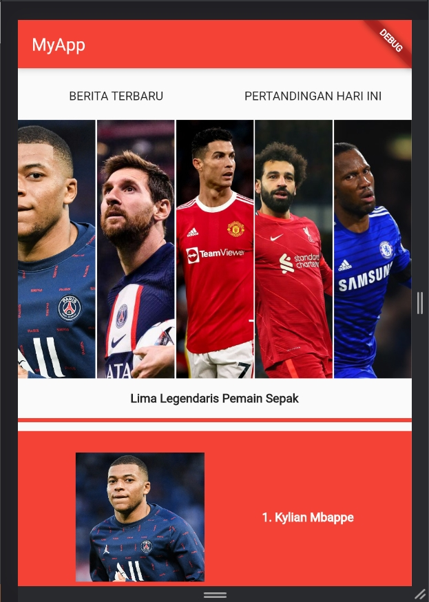
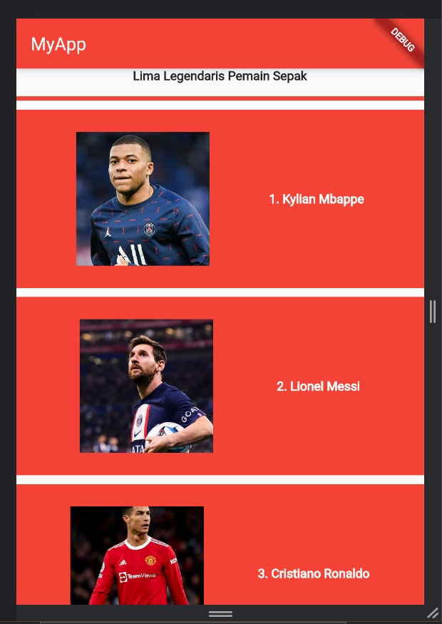

# Flutter Basic Widget

Silakan selesaikan Tugas Praktikum 1 membuat UI sederhana dengan push ke GitHub nama repo: basic_widget

Nama : Arya Admaja

Kelas : TI 3C / 06

NIM : 2041720104

## Screenshots

